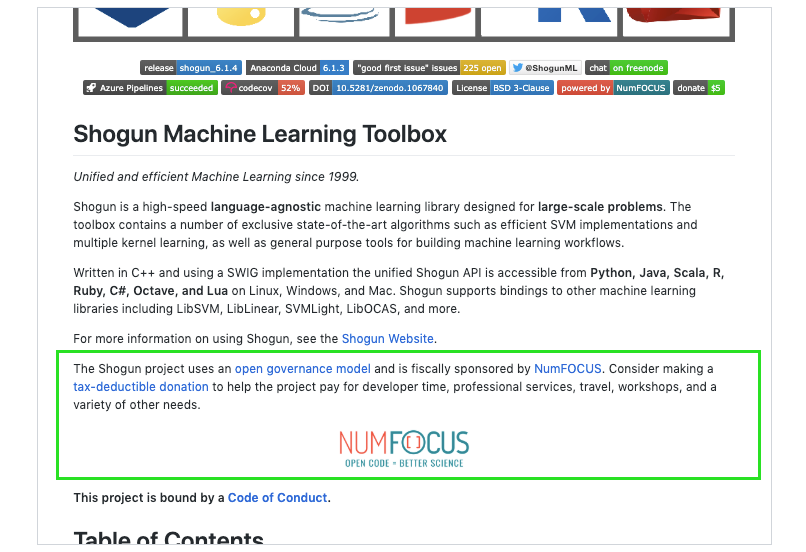
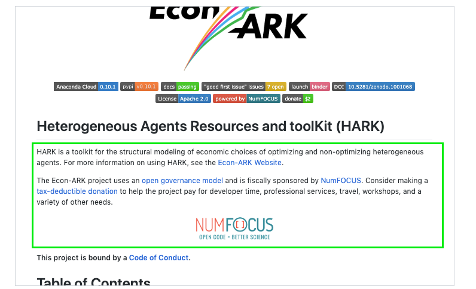

# Fiscal Sponsor README.md Attribution

Please include the below attribution template in your project's repository's `README.md`. 
It should go immediately below your project or library's description and before any 
specific details about your project or library.

## Examples

<div align="center">
  
  
</div>

## Template (Markdown)

```
[//]: # (numfocus-fiscal-sponsor-attribution)

The <PROJECT_NAME> project uses an [<PROJECT_GOVERNANCE_MODEL_NAME>](./GOVERNANCE.md) 
and is fiscally sponsored by [NumFOCUS](https://numfocus.org/). Consider making 
a [tax-deductible donation](<PROJECT_NUMFOCUS_DONATION_LINK>) to help the project 
pay for developer time, professional services, travel, workshops, and a variety of other needs.

<div align="center">
  <a href="<PROJECT_NUMFOCUS_SPONSORSHIP_LINK>">
    
  </a>
</div>
<br>
```

### Parameters

- `PROJECT_NAME` - the name of your project (e.g. `Econ-ARK project`)
- `PROJECT_GOVERNANCE_MODEL_NAME` - the name of your governance model (e.g. `BDFL`, `custom`, etc)
- `PROJECT_NUMFOCUS_DONATION_LINK` - the link to your NumFOCUS hosted project donation page.
	- Example: `https://numfocus.org/donate-to-econ-ark`
- `PROJECT_NUMFOCUS_SPONSORSHIP_LINK` - the link to your NumFOCUS hosted project sponsorship page.
	- Example: `https://numfocus.org/project/econ-ark`

### More 

- The line `[//]: # (numfocus-fiscal-sponsor-attribution)` is required.
	- We use this to automate checks as part of our sustainability audits.
- Use your best judgement with regards to grammar 
(e.g. staring with `The <PROJECT_NAME> uses ...` vs starting with `<PROJECT_NAME> uses...`).
- If your project doesn't use a standard governance model, then set `PROJECT_GOVERNANCE_MODEL_NAME` to `custom`.
- If your project has no `GOVERNANCE.md` at the root, then create a stub `GOVERNANCE.md` and include a link to your governance documentation or the appropriate parties to contact for more information.