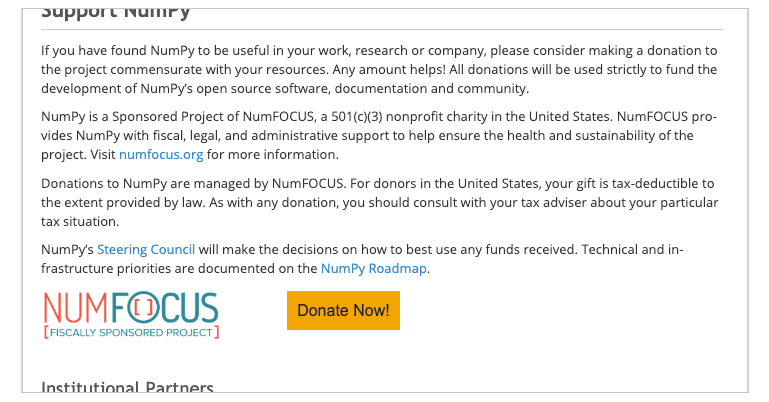

# Fiscal Sponsor Website Attribution

Please include the below language in your project website's landing page (e.g. `index.html`). 
**Use exact language**, with your project name filled in, alongside your project donation 
link and the NumFOCUS logo. 

We need your help to ensure that everyone in the community receives the same messaging 
about NumFOCUS and our relationship to your projects.

## Examples

<div align="center">
  
</div>

## Template (HTML)

```
<div name="numfocus-fiscal-sponsor-attribution">
  <p>
    <PROJECT_NAME> is a Sponsored Project of NumFOCUS, a 501(c)(3) nonprofit charity in the 
    United States. NumFOCUS provides <PROJECT_NAME> with fiscal, legal, and administrative 
    support to help ensure the health and sustainability of the project. 
    Visit <a href="https://numfocus.org" target="_blank">numfocus.org</a> 
    for more information.

    <br />

    Donations to <PROJECT_NAME> are managed by NumFOCUS. For donors in the United States, 
    your gift is tax-deductible to the extent provided by law. As with any donation, you 
    should consult with your tax adviser about your particular tax situation.
  </p>
</div>
```

### Parameters

- `PROJECT_NAME` - the name of your project (e.g. `NumPy`)

### More 

- Use exact language.
- The attribution **must be wrapped** inside an element with `name="numfocus-fiscal-sponsor-attribution"`.
	- Doesn't need to be a `div`, you are free to implement the markup however works best for you.
	- We use this to automate checks as part of our sustainability audits.
- You are welcome to add a short paragraph describing how your project makes use of the funds that 
come in and thanking users for their donations.